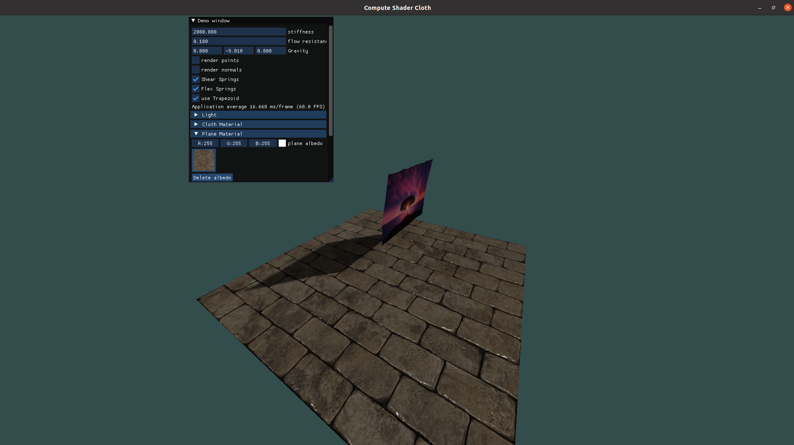

# Cloth Simulation with compute shaders

# Resources:

1. Integrators for simulation (https://www.embeddedrelated.com/showarticle/474.php)
2. OpenGL 4 Shading Language Cookbook (https://github.com/PacktPublishing/OpenGL-4-Shading-Language-Cookbook-Third-Edition
)

